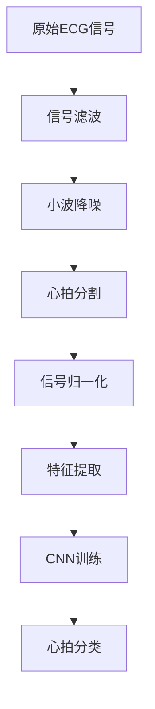

# ECG心电图智能分析系统

> **大学生创新创业训练计划项目**  
> 基于MIT-BIH心律失常数据库的心电信号智能分析系统

## 🎯 项目概述

这是一个**大学生创新创业训练计划（大创）项目**，旨在探索人工智能在医疗健康领域的应用。本系统实现了完整的ECG心电信号预处理、特征提取和深度学习分类流程，能够自动分析心电图信号，识别不同类型的心拍。

### 🎓 项目背景
- **项目性质**: 大学生创新创业训练计划
- **研究目标**: 探索深度学习在心律失常诊断中的应用
- **技术路线**: 信号处理 + 机器学习 + 医疗数据分析
- **学术价值**: 为心血管疾病智能诊断提供技术参考

## ⭐ 主要特性

- 🔧 **完整的信号处理流程**：从原始ECG信号到分类结果
- 🧠 **深度学习分类**：基于1D CNN的心拍类型识别  
- 📊 **多维特征提取**：时域特征 + 小波特征融合
- 🎨 **可视化支持**：心拍分割结果展示
- 📈 **高准确率**：验证准确率达98.46%
- 🎓 **教育价值**：适合学习信号处理和深度学习技术

## 🏆 创新点

1. **多域特征融合**：结合时域和小波域特征，提升分类性能
2. **端到端处理**：从原始信号到最终分类的完整流程
3. **可扩展架构**：模块化设计，便于功能扩展和算法优化
4. **实用性强**：基于真实医疗数据库，具有临床参考价值

## 📁 项目结构

```
Project/
├── README.md                   # 项目说明文档
├── requirements.txt            # 依赖包列表
├── ecg_main.py                # 🚀 主程序入口
├── ecg_preprocess.py          # 预处理流程集成
├── signal_read.py             # MIT-BIH数据读取
├── ecg_filter.py              # 信号滤波（基线漂移、工频干扰）
├── ecg_wavelet_denoising.py   # 小波降噪
├── ecg_segmenter.py           # 心拍分割
├── ecg_normalize.py           # 信号归一化
├── ecg_feature_extraction.py  # 时域特征提取
├── extract_wavelet_features.py# 小波特征提取
├── ecg_feature_extractor.py   # 特征集成模块
├── ecg_cnn_model.py           # CNN模型定义与训练
├── ecg_visualizer.py          # 可视化工具
├── module_test.py             # 模块测试脚本
├── test.py                    # 环境测试
└── data/                      # MIT-BIH数据存放目录
    ├── 100.dat               # 示例：MIT-BIH记录100
    ├── 100.hea
    └── 100.atr
```

## 🛠 环境要求

- **Python**: 3.8 - 3.10
- **操作系统**: Windows/Linux/macOS
- **内存**: 建议4GB以上
- **存储**: 至少1GB可用空间

## 📦 安装指南

### 1. 克隆项目

```bash
git clone https://github.com/Turman8/Project.git
cd Project
```

### 2. 创建虚拟环境（推荐）

```bash
# 使用conda
conda create -n ecg python=3.10
conda activate ecg

# 或使用venv
python -m venv ecg_env
# Windows
ecg_env\Scripts\activate
# Linux/macOS
source ecg_env/bin/activate
```

### 3. 安装依赖包

```bash
pip install -r requirements.txt
```

或手动安装：

```bash
pip install numpy scipy wfdb PyWavelets tensorflow scikit-learn matplotlib pandas
```

### 4. 验证安装

```bash
python module_test.py
```

## 🚀 快速开始

### 1. 准备数据

下载MIT-BIH心律失常数据库文件到`data/`目录：

```
data/
├── 100.dat    # 信号数据
├── 100.hea    # 头文件
└── 100.atr    # 标注文件
```

### 2. 运行主程序

```bash
python ecg_main.py
```

### 3. 查看结果

程序将输出训练过程和最终结果：

```
Epoch 20/20
57/57 - loss: 0.1133 - accuracy: 0.9857 - val_loss: 0.0763 - val_accuracy: 0.9846
模型训练完成 | 特征维度: (2271, 20)
```

## 📊 算法流程



### 详细步骤：

1. **信号预处理**
   - 基线漂移消除（高通滤波 0.5Hz）
   - 工频干扰抑制（陷波滤波 50Hz）
   - 小波降噪（db4小波，4层分解）

2. **心拍分割**
   - 基于R峰检测分割心拍
   - 固定窗口长度：300点（前100点+后199点）
   - 支持多种心拍类型：N, L, R, V, A, F, E, J

3. **特征提取**
   - **时域特征**：RR间期、QRS持续时间、振幅特征等
   - **小波特征**：熵、能量比、标准差等
   - **特征融合**：20维特征向量

4. **深度学习分类**
   - 1D卷积神经网络
   - 自适应学习率调整
   - 20% 数据用于验证

## 🎯 性能指标

| 指标 | 数值 |
|------|------|
| 训练准确率 | 98.57% |
| 验证准确率 | 98.46% |
| 特征维度 | 20 |
| 心拍样本数 | 2271 |
| 训练轮次 | 20 |

## 🔧 自定义使用

### 修改训练参数

```python
# 在 ecg_cnn_model.py 中
model, history = build_and_train_model(
    features, labels, 
    epochs=50,        # 增加训练轮次
    batch_size=64     # 调整批大小
)
```

### 添加新的特征

```python
# 在 ecg_feature_extraction.py 中添加自定义特征
def extract_custom_features(beats):
    # 您的特征提取代码
    pass
```

### 使用不同数据

```python
# 修改 ecg_main.py 中的数据路径
model, features, labels = main('data/101')  # 使用记录101
```

## 📈 可视化功能

生成心拍分割可视化图：

```python
from ecg_visualizer import visualize_segmentation

# 可视化心拍分割结果
visualize_segmentation(signals, r_peaks, beats, labels)
```

## ⚠️ 常见问题

### Q: TensorFlow出现CUDA警告
A: 这是正常现象，表示没有GPU支持，程序会自动使用CPU运行。

### Q: 模块导入失败
A: 请确保所有依赖包已正确安装，运行 `python module_test.py` 检查。

### Q: 数据文件错误
A: 确认MIT-BIH数据文件格式正确，包含 `.dat`, `.hea`, `.atr` 三个文件。

### Q: 内存不足
A: 可以减少批大小或使用更小的数据集进行测试。

## 🔬 技术细节

### 小波降噪

- **小波基**: Daubechies 4 (db4)
- **分解层数**: 4层
- **阈值类型**: 软阈值
- **阈值计算**: 通用阈值公式

### CNN架构

```python
Sequential([
    Conv1D(32, 3, activation='relu'),
    MaxPooling1D(2),
    Flatten(),
    Dense(64, activation='relu'),
    Dropout(0.5),
    Dense(num_classes, activation='softmax')
])
```

### 特征详情

**时域特征 (8维)**:
- RR间期、QRS持续时间、QT间期
- R波、Q波、S波、T波振幅
- ST段斜率

**小波特征 (12维)**:
- 4层细节系数的熵、能量比、标准差

## 📚 参考资料

- [MIT-BIH Arrhythmia Database](https://physionet.org/content/mitdb/1.0.0/)
- [WFDB Python Package](https://wfdb.readthedocs.io/)
- [TensorFlow Documentation](https://www.tensorflow.org/)
- [PyWavelets Documentation](https://pywavelets.readthedocs.io/)

## 🤝 贡献指南

欢迎其他同学和研究者参与项目改进！

### 如何贡献
1. Fork 本项目到您的账户
2. 创建功能分支 (`git checkout -b feature/新功能`)
3. 提交更改 (`git commit -m '添加某某功能'`)
4. 推送到分支 (`git push origin feature/新功能`)
5. 发起 Pull Request

### 贡献方向
- 🔬 **算法优化**: 改进特征提取或分类算法
- 📊 **数据扩展**: 支持更多ECG数据库
- 🎨 **可视化**: 增强图表和界面展示
- 📚 **文档**: 完善技术文档和使用说明
- 🐛 **问题修复**: 发现并修复代码问题

### 学术交流
- 欢迎在Issues中讨论技术问题
- 分享您的改进思路和实验结果
- 共同推进项目的学术价值

## 📄 许可证

本项目采用 MIT 许可证 - 查看 [LICENSE](LICENSE) 文件了解详情。

**声明**: 本项目为大学生创新创业训练计划项目，仅用于学术研究和教育目的，非商业用途。

## 👨‍💻 项目团队

**项目负责人**: Turman8

- GitHub: [@Turman8](https://github.com/Turman8)
- 项目类型: 大学生创新创业训练计划

## 🎓 学术说明

### 研究意义
- 探索人工智能在医疗诊断中的应用潜力
- 学习和实践信号处理、机器学习等前沿技术
- 为心血管疾病智能诊断提供技术验证

### 技术贡献
- 实现了完整的ECG信号智能分析流程
- 验证了深度学习在心律失常检测中的有效性
- 提供了可复现的实验环境和代码实现

### 应用前景
- 辅助医生进行心电图分析
- 提高心律失常诊断效率
- 为远程医疗和健康监测提供技术支撑

- `ecg_visualizer.py`：信号与心拍可视化。

---

## 典型流程示意

1. 读取原始信号
2. 滤波去噪
3. 小波降噪
4. 心拍分割
5. 归一化
6. 特征提取
7. 可视化

---

## 联系方式

如有问题或建议，请联系项目维护者